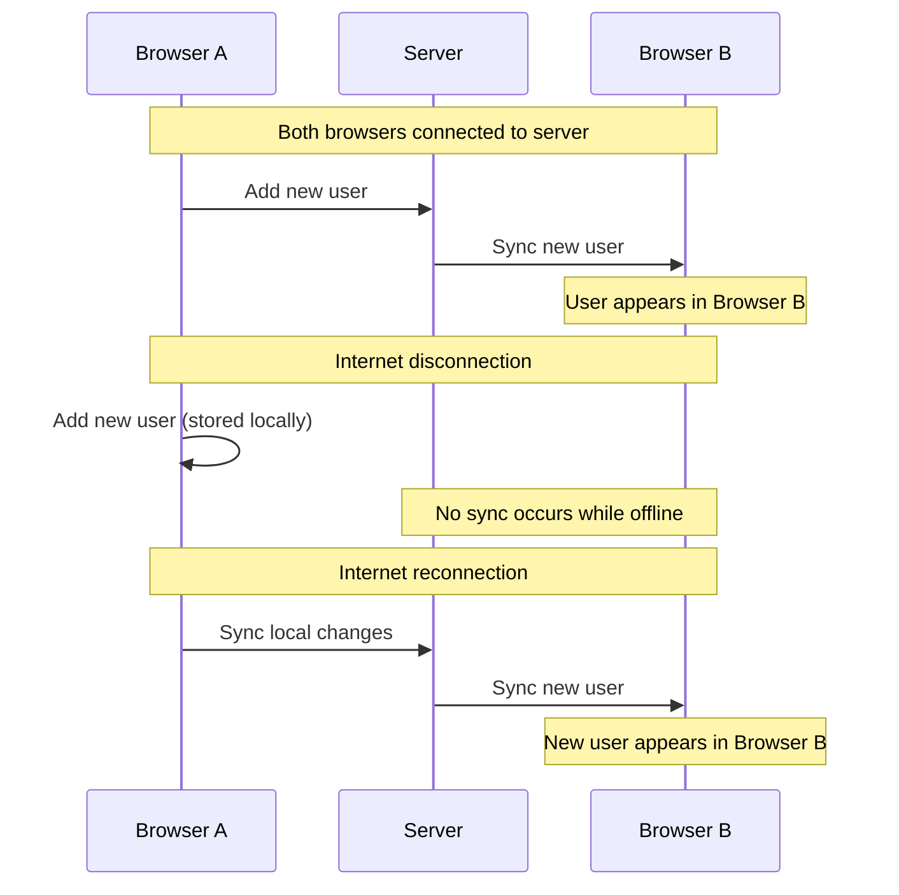
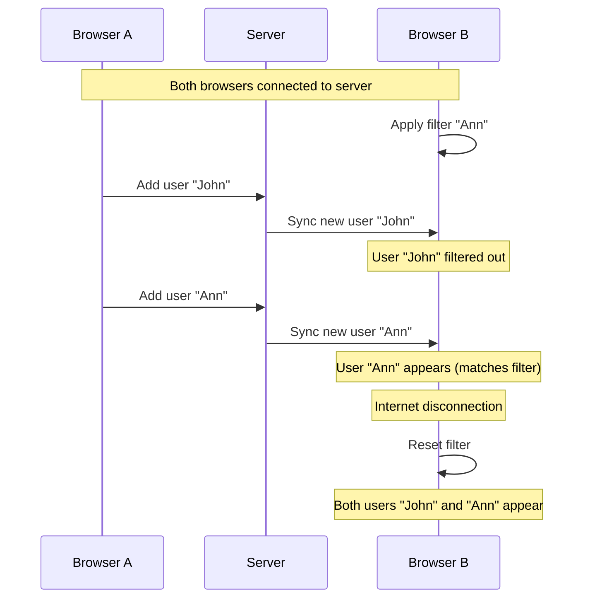

# Sync Test Task Documentation

The ultimate goal of the task is to test the frontend side of [Phoenix Sync](https://www.youtube.com/watch?v=4IWShnVuRCg) 

# Task

A local-first user registry application.
 - A list where users can be created and filtered by name.
 - User is identified by public key. 
 - Public key is created using ECC secp256k1. Private key can be dropped (is not used in this app) 

The app should be built using [Electric SQL write through the db approach](https://electric-sql.com/docs/guides/writes#through-the-db). 

## Workflows

### Main workflow scenario:
 - Open the app in two browsers (A and B)
 - Browser A adds a new user
 - Browser B should see the new user
 - Disconnect your internet connection
 - Browser A adds a new user
 - Browser B should not see the new user yet
 - Reconnect your internet connection
 - Browser B should see the new user

### Filtered workflow scenario:
 - Open the app in two browsers (A and B)
 - Browser B filters users by name "Ann"
 - Browser A adds a new user with name "John"
 - Browser B should not see the new user yet since it is not Ann
 - Browser A adds a new user with name "Ann"
 - Browser B should see the new user "Ann"
 - Browser B disconnects from the internet
 - Browser B resets the filter
 - Browser B should see all users "John" and "Ann"

## Technical details

### Reads
Reading from a server is done through `/shapes/users` endpoint. [Example](https://github.com/Buckitup-chat/sync_test/blob/main/get_users.sh)
See [Electric SQL OpenAPI](https://electric-sql.com/openapi.html) for more details.

### Writes
Writing to a server is done through `/ingest/mutations` endpoint. [Example](https://github.com/Buckitup-chat/sync_test/blob/main/post_user.sh)
It uses [TanStack](https://tanstack.com/) mutation format for writing.
